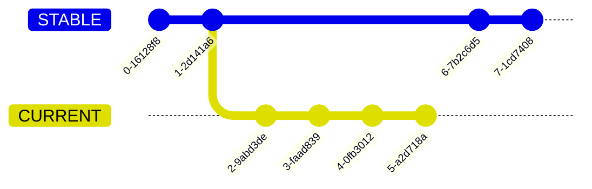

[](https://github.com/gravwell/sync-branches/actions/workflows/test.yml)

# Sync Branches

Use this Action to automatically open PRs from a given pattern of source branch to a given target branch.

**Note**: This action doesn't currently support opening PRs across forks.

## Inputs

| Field                     | Description                                                                                                                                                                                                                                                                                                                                                                                                                                                                 | Required |
| ------------------------- | --------------------------------------------------------------------------------------------------------------------------------------------------------------------------------------------------------------------------------------------------------------------------------------------------------------------------------------------------------------------------------------------------------------------------------------------------------------------------- | -------- |
| `GITHUB_TOKEN`            | Token used to inspect PRs, merge updates, and create intermediate branches as required. Probably `${{ github.token }}`                                                                                                                                                                                                                                                                                                                                                      | Yes      |
| `PR_CREATE_TOKEN`         | The token used to open PRs. Must be a Personal Access Token (PAT), not `GITHUB_TOKEN`. PRs opened with `GITHUB_TOKEN` will not run Actions: https://github.com/orgs/community/discussions/55906 If you want newly-opened PRs to run actions, you'll need to provide a PAT for `PR_CREATE_TOKEN`. A fine-grained PAT will work. It requires Read and Write for PR and Read for Content. If `PR_CREATE_TOKEN` is omitted, `GITHUB_TOKEN` will be used to create PRs.          | No       |
| `use_intermediate_branch` | Set to false to open PRs directly from source branches to target branches. Set to true to merge the source and target branches into an intermediate branch, and open a PR from the intermediate branch to the target branch. Intermediate branches are automatically updated whenever the source branch or target branch is updated. Intermediate branches are useful when branch protections require the head (source) branch be up-to-date with the base (target) branch. | Yes      |
| `source_pattern`          | The branch (or pattern) to use for the PR source (head).                                                                                                                                                                                                                                                                                                                                                                                                                    | Yes      |
| `target_pattern`          | The branch (or pattern) to use for the PR target (base).                                                                                                                                                                                                                                                                                                                                                                                                                    | Yes      |
| `pr_title`                | A mustache-templated string to use to construct the PR title                                                                                                                                                                                                                                                                                                                                                                                                                | No       |
| `pr_body`                 | A mustache-templated string to use to construct the PR body                                                                                                                                                                                                                                                                                                                                                                                                                 | No       |
| `source_conflict_label`   | A label to apply when a conflict is detected between the source branch and intermediate branch. Not relevant if there's no intermediate branch. If omitted, then no labels will be applied                                                                                                                                                                                                                                                                                  | No       |
| `target_conflict_label`   | A label to apply when a conflict is detected between the intermediate branch and the target branch. If not using an intermediate branch, this label will be applied if there is a conflict between the source branch and target branch. If omitted, then no labels will be applied.                                                                                                                                                                                         | No       |

### Intermediate Branches

You must specify if you want `sync-branches` to use an intermediate branch when opening pull requests.

Depending on branch protection requirements (e.g. "Require branches to be up to date before merging"), you may find it necessary to use an intermediate branch.

Let's say you want to merge branch `STABLE` into branch `CURRENT` whenever there's an update to `STABLE`. In that case, your `source_pattern` would be `STABLE` and your `target_pattern` would be `CURRENT`.

#### With an Intermediate Branch

`sync-branches` will create an intermediate branch named `merge/STABLE_to_CURRENT` that has both `STABLE` and `CURRENT` merged to it. It will then open a PR where `merge/STABLE_to_CURRENT` is the head branch, and `CURRENT` is the base branch.


When that PR is merged, your git graph will look something like...


#### Without an Intermediate Branch

`sync-branches` will open a PR where `STABLE` is the head branch, and `CURRENT` is the base branch.



When that PR is merged, your git graph will look something like...


### Mustache Context

`pr_title` and `pr_body` can be [mustache templates](https://mustache.github.io/mustache.5.html).

The following items are available in the template view / context.

    const templateContext = {
    		source_pattern,
    		original_source: originalHead,
    		source: head,
    		target,
    		use_intermediate_branch,
    	};

| Field                     | Description                                                                 |
| ------------------------- | --------------------------------------------------------------------------- |
| `source_pattern`          | The `source_pattern` passed as input to `with:`                             |
| `original_source`         | The name of the actual source branch - the branch that matches the pattern. |
| `source`                  | The name of the branch being used as the `head` in the PR.                  |
| `target`                  | The `target` passed as input to `with:`                                     |
| `use_intermediate_branch` | The `use_intermediate_branch` passed as input to `with:`                    |

## Outputs

`sync-branches` sets one output to describe PRs that were updated.

### `syncedPRs`

`syncedPRs` is a JSON-encoded array of objects. Each object describes an updated PR. The objects have the following fields...

```ts
/** Describes an updated PR */
type PRUpdate = {
	/** The source branch (changes come FROM this branch) */
	sourceBranch: string;
	/** The target branch (changes are heading TO this branch) */
	targetBranch: string;

	/** The head branch of the PR (same as source branch unless using an intermediate branch) */
	headBranch: string;
	/** The base branch of the PR (same as target branch) */
	baseBranch: string;

	/** The URL of the PR's web page */
	url: string;
};
```

Since it's JSON-encoded, you'll need to decode it. `jq` is very handy for working with JSON in workflows.

```yaml
- name: PR STABLE to CURRENT
  id: sync-branches
  uses: 'gravwell/sync-branches@v1'
  with:
    GITHUB_TOKEN: '${{ github.token }}'
    source_pattern: STABLE
    target_pattern: CURRENT
    use_intermediate_branch: 'True'
- name: Use Outputs
  run: |
    for pr in $(echo '${{ steps.sync-branches.outputs.syncedPRs }}' | jq -r 'map(.|tojson) | join (" ")')
    do
      echo $pr
    done
```

## Example

```yaml
on:
  push:
    branches:
      - release/* # You'll want to limit to branches. Pushes to tags don't make sense to this action.

jobs:
  test-with-intermediate:
    runs-on: ubuntu-latest
    steps:
      - uses: actions/checkout@v3
      - uses: gravwell/sync-branches@v1
        with:
          GITHUB_TOKEN: ${{ github.token }}
          PR_CREATE_TOKEN: ${{ secrets.MY_PAT }}
          use_intermediate_branch: true
          source_pattern: release/*
          target_pattern: main
```
